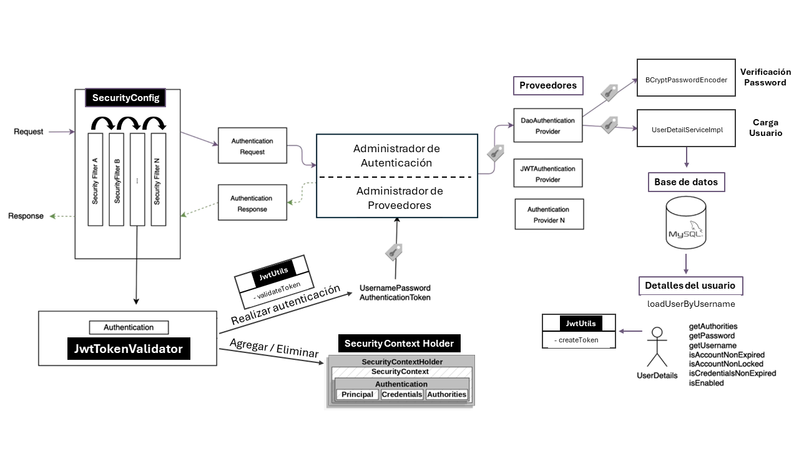
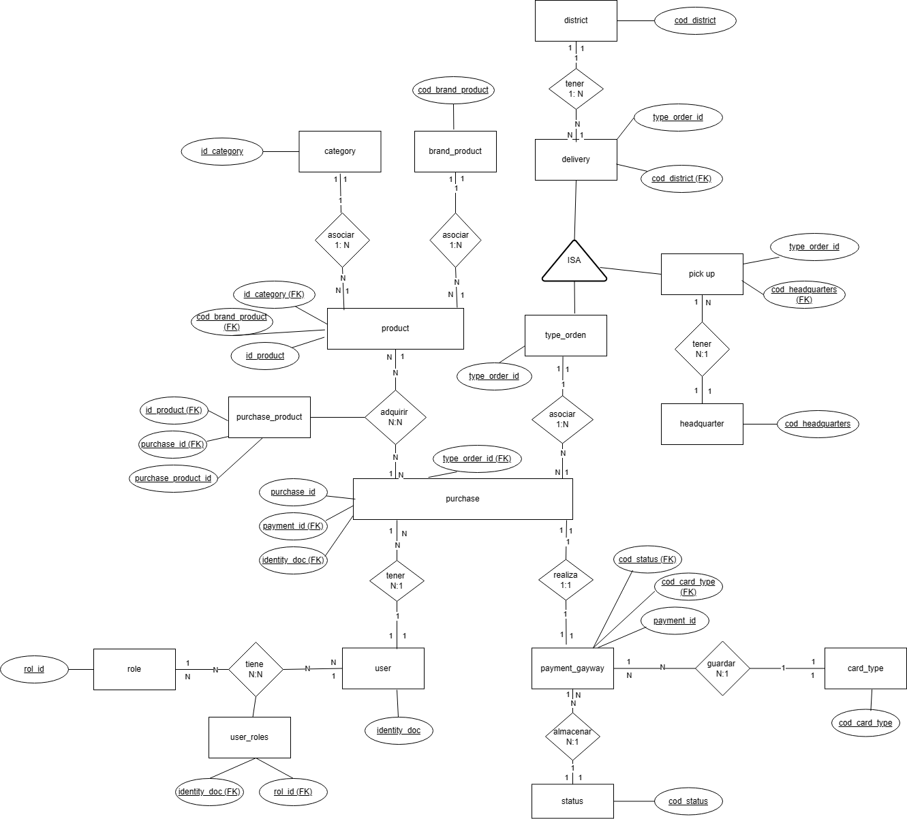
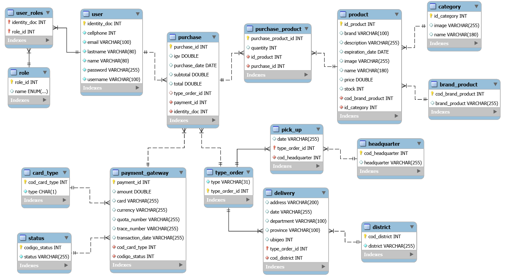

 

## 📌 Repositorios relacionados

[API-REST-BoraBora-Kotlin](https://github.com/CarlosAcosta4/apirest-borabora-android-kotlin) &nbsp;| &nbsp; [AppBoraBora-Kotlin](https://github.com/brigittev0/AppBoraMovil) &nbsp;| &nbsp; [Scripts SQL-API](https://github.com/CarlosAcosta4/resources-apis-borabora) &nbsp;

Por favor, consulta los repositorios correspondientes para obtener sus instrucciones.

 

## 📑 Pre-requisitos

Antes de ejecutar este proyecto, debes asegurarte de que:

1. Tienes instalado Maven en tu sistema. Puedes verificarlo ejecutando `mvn -v` en la terminal.
2. Tienes instalado Spring Tool Suite (STS) u otro IDE compatible con proyectos Maven.
3. Tienes instalado MySQL y está corriendo en tu sistema.
4. No tienes una base de datos con el nombre especificado en el archivo `application.properties` (`bd_borabora` en este caso).
5. El puerto especificado en el archivo `application.properties` (`8070` en este caso) no está siendo utilizado por otra aplicación.
6. Los valores de `username` y `password` en el archivo `application.properties` coinciden con tus credenciales de MySQL.

 

## 🔢 Ejecución

Para ejecutar este proyecto en Spring Tool Suite (STS), sigue estos pasos:

1. Importa el proyecto en STS: File -> Import -> Maven -> Existing Maven Projects.
2. Navega y selecciona el directorio del proyecto.
3. Haz clic en Finish para importar el proyecto.
4. Una vez importado, haz clic derecho en el proyecto en el explorador de proyectos.
5. Selecciona Run As -> Spring Boot App.
6. El proyecto debería comenzar a ejecutarse en el puerto especificado (8070 en este caso).

 

## ❗ Detalles Importantes del Proyecto
- **Algoritmo de Encriptación del Token**: Este proyecto utiliza el algoritmo HS256 para la encriptación del token.
- **Duración del Token**: El token generado tiene una duración de 30 minutos.

 

## 📋 Inserción de datos
Una vez que las tablas se han creado en la base de datos, puedes utilizar los scripts SQL disponibles en este [repositorio](https://github.com/CarlosAcosta4/resources-apis-borabora) para insertar datos.

 

  
## 🔹 Arquitectura del Proyecto Bodega BoraBora

 

## 🔸 Diagrama de Flujo de Autenticación y Autorización JWT con Spring Security

 

## 🔹 Diagrama Conceptual de la Base de Datos

 

## 🔸 Diagrama Físico de la Base de Datos

 

## 💻 Autores

(<a href="#readme-top">volver arriba</a>)

